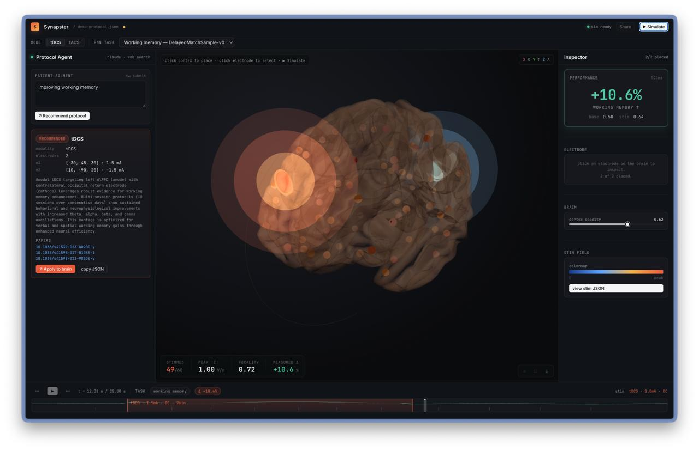

# Synapster

**https://synapster-two.vercel.app**

*password:* **operators&friends**


**Type a patient's symptoms. Watch an AI design a brain-stimulation
treatment, citing real medical papers — and then see, region by region,
exactly what that treatment does inside a model of the brain.** The 
"brain" is a CTRNN wired by a real human connectome and trained on 
three cognitive tasks on a high performance cluster. The "stimulation" 
is real V/m field physics coupled into the model dynamics.

A 3D brain running in your browser.

---

## Why this matters

Brain stimulation is real medicine. For some patients with depression
that doesn't respond to drugs, doctors place electrodes on the scalp
and pass a small current through the brain. There are protocols, there
are papers, and there are clinical trials. The hard part is choosing
*which* protocol for *which* patient, and predicting what it will
actually do inside that person's head.

Today, that choice is mostly heuristic — a clinician picks a published
protocol and hopes the patient resembles the average trial subject.

Synapster is a small, honest step toward something better:

1. **An AI that does the research for you.** Tell it the patient's
   ailment in plain English. It searches the recent clinical
   literature live, picks a protocol, and tells you which papers
   it cited. No black-box recommendation — every claim is sourced.

2. **A simulator that shows you what the protocol does.** The dashboard
   places the electrodes the AI proposed on a 3D model of the brain.
   Then it shows you what would happen in real time: which brain
   regions activate, how strongly, on what timescale. You don't have
   to trust the AI's rationale — you can see the consequence.

3. **A grounding in real anatomy and real physics.** No fictional
   regions, no waved-away coupling constants. The brain model uses a
   human connectome (the actual wiring map of a human brain, taken
   from MRI). The electrode physics use the textbook equations for
   tDCS, tACS, and TI. Every number traces back to a published source.

The combination — AI agent plus transparent simulator plus real
anatomy — is what makes this more than a demo and more than a chatbot.

---

## What you actually do

1. **Type a patient ailment.**
   *e.g., "treatment-resistant depression."*

2. **The AI side panel goes to work.** It calls Claude with web search
   enabled. Claude reads recent clinical papers and returns a
   structured protocol: the modality (tDCS, tACS, or TI), where to
   place each electrode in standard brain coordinates, how much current
   to use, what frequency, plus a short rationale and the papers it
   cited.

3. **The dashboard places the electrodes automatically** on a 3D model
   of the brain.

4. **You hit play.** The simulator computes the electric field that
   the electrodes generate, propagates it through the brain model,
   and shows you the activity in each of 68 brain regions over time.

5. **You compare.** Toggle the stimulation off and on. Switch between
   three cognitive tasks the brain is performing — perceptual decision,
   working memory, reaction time. See where the protocol does and
   doesn't help.

---
## Example



*A simulation of a clinical protocol designed to improve the working memory, showing that it actually improves the working memory performance based on the CTRNN trained on memory tasks.*

---

## How it works (without the jargon)

### The brain
A simplified model of the human cortex. 68 brain regions, each
represented by one neural unit. The wiring between them comes from a
real human connectome — actual measurements of which brain regions are
connected to which, taken from MRI in human subjects. The model has
been trained to perform three cognitive tasks, so it isn't a static
mannequin: it's *doing something* when stimulation arrives.

Think of it as a flight simulator for the cortex.

### The stimulation
Three real medical techniques:

- **tDCS** — a steady direct current passed between two electrodes.
- **tACS** — an oscillating current at a chosen frequency.
- **TI** (temporal interference) — two oscillating currents at slightly
  different frequencies that combine deep inside the brain to create
  a slow, focal stimulation.

When you place an electrode on the model's scalp, the dashboard
computes the actual electric field reaching each region — the field
falls off with the square of distance, oscillates if the current
oscillates, and so on. That field is fed into the brain model as an
extra input current. The brain's activity changes in response. Crucially,
the stimulation **doesn't retrain the brain** — it perturbs it, the same
way real stimulation perturbs a real cortex.

### The AI
You type a patient ailment. A separate small server takes that text
and asks Claude (with live web search). Claude searches recent papers,
synthesizes a protocol, and returns structured JSON with electrode
positions, currents, frequencies, a rationale, and the citations.
The dashboard reads the JSON and renders the protocol on the brain.

The "AI agent" piece is straightforward: the LLM does real research
and emits a structured artifact that drives a real simulator. It isn't
just generating prose about brain stimulation — it's commissioning
an experiment.

---

## Why this is genuinely interesting

- **Grounded in real data.** Real brain anatomy from FreeSurfer's
  Desikan–Killiany atlas. Real connectivity from the ENIGMA Toolbox
  (which packages human structural connectomes). Real electrode physics.
  Real medical papers cited live by name.

- **Transparent.** You don't have to take the AI's word for anything.
  Its protocol is rendered. Its sources are listed. Its predicted
  effect on the brain is simulated and visible.

- **Closed-loop in the way that matters.** Symptom → literature →
  protocol → simulation → behavior. The full cycle of evidence-based
  protocol design, automated and visible end-to-end.

- **Honest about its limits.** The model is small (68 regions, not the
  ~100 billion neurons in a real brain). High-frequency stimulation
  gets blurred by the model's time constant — true in real neurons too,
  but we surface it rather than hide it. The connectome is one
  averaged human, not a specific patient — yet. We tell you where
  the floor is, instead of pretending there isn't one.

---

## Real-world relevance

The shortest pitch: **AI-assisted protocol design for non-invasive
brain stimulation.**

- **Treatment-resistant depression.** When SSRIs fail, tDCS over the
  dorsolateral prefrontal cortex is one of the standard escalations.
  The AI walks through the recent literature, places the electrodes,
  and the simulator shows you the cortical reach.

- **Pre-clinical screening.** Investigators iterate on protocols
  against a digital twin before any human trial. Off-target activation
  and unexpected coupling become visible at design time, not after
  patient enrollment.

- **Personalized stimulation.** Substitute a patient-specific
  connectome from diffusion MRI and the same loop becomes per-patient.
  The architecture doesn't change; only the wiring matrix.

- **Education.** Med students, neuroscience trainees, and BME
  researchers get the same physics-grounded interface a serious
  modeling pipeline uses, without the months of setup.

This is "AI agents do real things in the world": the LLM is not
generating prose *about* brain stimulation — it is *operating* a
brain-stimulation simulator.

---

## Architecture

```
[ user types ailment ]
        │
        ▼
[ Flask server :5001 ] ──► Claude with web search
        │                       │
        │                       ▼
        │              { modality, electrodes, rationale, papers }
        ▼
[ 3D dashboard (Vite + react-three-fiber) ]
   places electrodes, computes V/m field per region
        │
        ▼
[ FastAPI inference server :8000 ]
   coupling α, CTRNN forward pass
        │
        ▼
{ activations: T × 68 regions, task readout }
        │
        ▼
[ dashboard plays back the brain's response ]
```

Two backend servers (one for the LLM, one for the brain simulator)
plus one frontend. The deployment for the demo is described in
[DEPLOY.md](DEPLOY.md): Vercel-hosted dashboard, FastAPI behind a
Cloudflare tunnel, password-gated.

---

## What's actually shipped

| Component | State |
|---|---|
| 68-unit CTRNN brain model with real-connectome wiring | built |
| Three pre-trained task models (decision, memory, timing) | built — see `ctrnn/bundles/` |
| FastAPI inference server (`/tasks`, `/bundle/<task>`, `/infer`) | built — see `ctrnn/infer_server.py` |
| MNI-space region coordinates (the static brain map) | built — see `ctrnn/bundles/aparc_centroids.json` |
| Stimulation physics (tDCS / tACS / TI) | dashboard side |
| 3D brain rendering, electrode placement, playback | dashboard side |
| LLM protocol agent (Claude + web search → protocol JSON) | built — see `llm/protocol_agent.py` |
| Live deployment behind password (Vercel + Cloudflare) | shipped |
| HPC training pipeline (PBS scripts, CUDA env) | built — see `scripts/` |
| Patient-specific connectomes from diffusion MRI | future work |
| Multi-region cross-task coupling | future work |

---

## Going deeper

- **Setup and the integration contract:** [SETUP.md](SETUP.md)
- **Demo deployment runbook:** [DEPLOY.md](DEPLOY.md)
- **Research foundation:** [docs/](docs/) — the seven papers this
  project reads from, including spatially-embedded RNNs, multi-region
  cortical theory, and TI for epilepsy.
- **Demo screenshot guide for posts and decks:** [DEMO.md](DEMO.md)

---

## Hack window

Three hours. Four people. Every line written in the room.